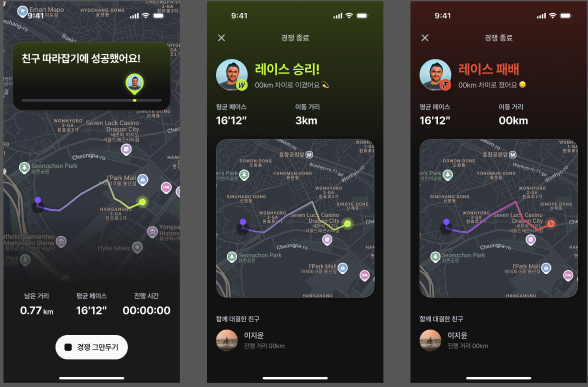
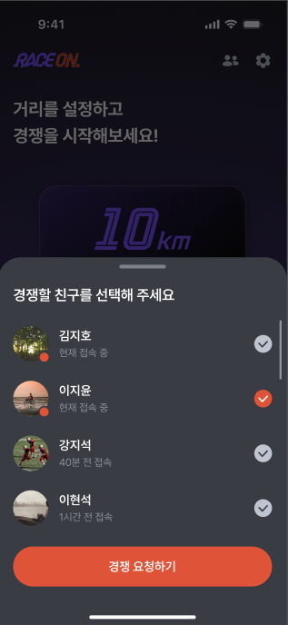
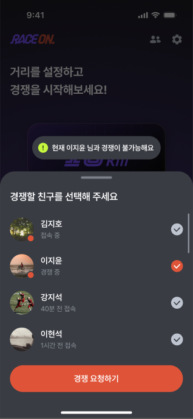
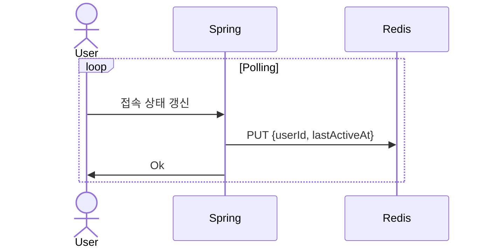
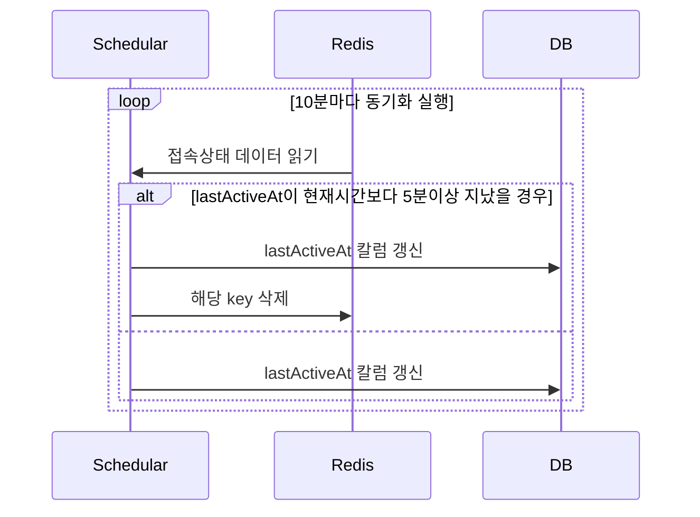
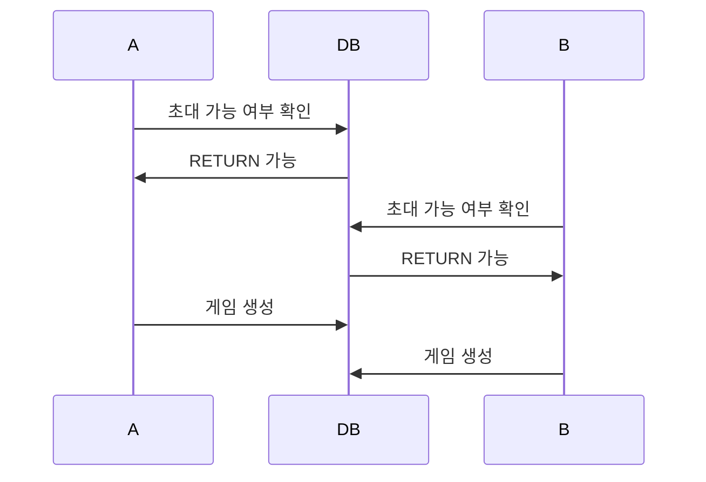
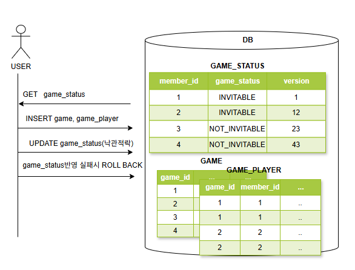
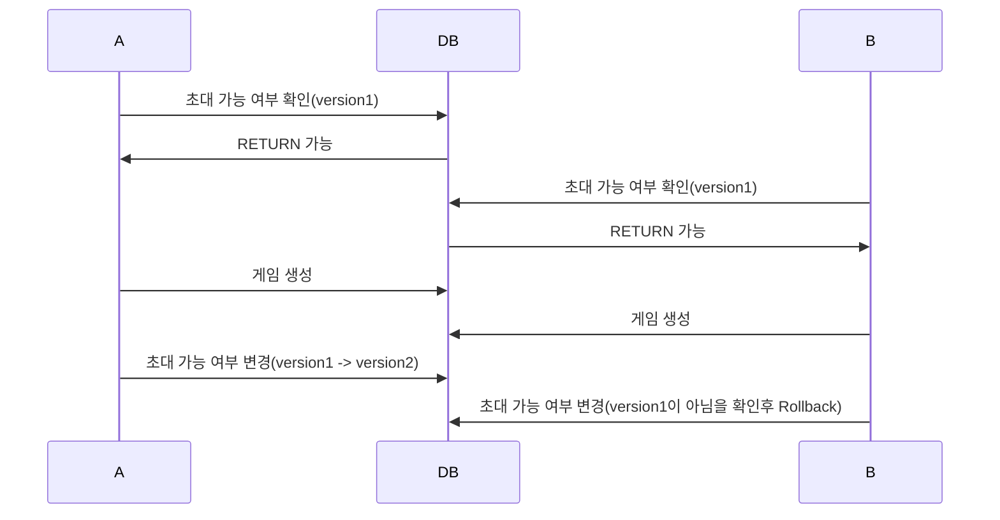

# Race-On

## 💡 프로젝트 한 줄 소개
Race-On은 친구와 함게 실시간으로 경쟁하면서 러닝을 즐길 수 있는 서비스입니다. 🏃🏃



※ 프로젝트에 대해 더 자세히 알고 싶으시다면 아래 링크들을 참고해주시기 바랍니다.

[📑 프로젝트 소개 페이지 바로가기]()

[📊 ERD 설계 바로가기](https://www.erdcloud.com/d/yai2j3mWH8T7xiN37)

[🎨 Figma 디자인 작업 바로가기](https://www.figma.com/design/xzMBGfaope5mtYuiON81ru/RACE-ON?node-id=12-54&t=GE8jm7EI9AzGZhIE-0)

## 🔧 기술 스택
- Application: Java 17, Spring Boot 3.3, JPA, Redis, Redis Pub/Sub, MySQL 8.0
- Infra: AWS, ALB, EC2, CodeDeploy, S3 

<!-- ## 🏗️ 프로젝트 아키텍처 -->

## 💭 프로젝트를 진행하며 했던 고민들..
[1. Redis를 통한 쓰기지연으로 RDB 부하를 최소화 하기](#1-redis를-통한-쓰기-지연으로-rdb부하를-최소화-하기)

[2. 게임 초대시 발생한 Write Skew 문제를 낙관적 락으로 해결한 경험](#2-게임-초대시-발생한-동시성-문제를-낙관적-락으로-해결한-경험-write-skew)

<!-- [3. 정상종료 되지 않은 게임 때문에 초대가 되지 않는 현상 해결 (feat. 기존 스케줄러를 활용한 방법에서 스케줄러 덜어내기)](#3-정상종료-되지-않은-게임-때문에-초대가-되지-않는-현상-해결-feat-기존-스케줄러를-활용한-방법에서-스케줄러-덜어내기) -->

## 1. Redis를 통한 쓰기 지연으로 RDB부하를 최소화 하기

### 요구사항
 

- 친구 화면에서 친구들의 접속 상태와 게임여부를 보여줘야 한다.
- 친구 화면에서 유저는 30초마다 친구들의 접속 상태를 확인하는 API를 요청해서 친구들의 접속상태, 게임 여부를 최신화 해줘야한다.
- 유저는 마지막 접속 시간을 갱신하기 위해 서버로 접속 중임을 알리는 API를 30초마다 요청해야한다.

### 문제 상황
- Polling을 통해 잦은 쓰기 연산이 필요. RDB 부하가 예상 됨.

### [해결] Write Back 전략으로 Redis 에만 접속 시간 갱신 (갱신 API TPS 85 -> 249)
1. RDB가 아닌 Redis에서 접속 시간 갱신.
2. 10분마다 RDB와의 데이터 동기화

</br>

#### 1. Redis에 접속 시간 갱신

싱글 쓰레드 기반 인메모리 DB인 Redis는 RDBMS보다 쓰기 연산 성능이 좋다.

RDB가 아닌 Redis에 접속 시간을 갱신하여 빠른 응답 속도를 확보하고자 했다.

</br>

#### 2. 10분마다 RDB와의 데이터 동기화

Redis를 통해 쓰기 연산 속도를 올렸지만, Redis는 인메모리 DB로 영속성이 보장되지 않는다.

영속성을 위해 Redis 데이터를 10분마다 RDBMS에 동기화하였다. (쓰기 지연)

</br>

## 2. 게임 초대시 발생한 동시성 문제를 낙관적 락으로 해결한 경험 (Write Skew)

### 용어정의
매칭중 : 게임을 초대 했거나 초대 받은 상태로 아직 게임이 시작되지 않은 상태

### 요구사항
게임중/매칭중인 유저에게는 게임 초대를 보낼 수 없다.

### 문제상황
여러 유저가 거의 동시에 한 유저에게 게임 초대 요청을 보낼 경우 한 유저가 두 개의 게임에 동시에 초대된다.

### 문제분석
요구사항에 따라 동시성 문제를 해결해야 하지만 여러명의 유저가 하나의 유저에게 거의 동시에 초대할 가능성은 거의 없다.

즉, 해당 버그의 발생 가능성이 낮다.

### 버그 발생 시나리오

#### A,B가 C를 동시에 초대하는 상황


#### 초대 가능 여부 확인:
```
 SELECT * FROM GAME_PLAYER 
 WHERE status in ("ONGOING","MATCHING") 
 AND member_id in (A,C);
```

#### 게임 생성:
```
INSERT INTO GAME
INSERT INTO GAME_PLAYER A,C
```

### 원인
1. GAME_PLAYER 테이블의 특정 레코드 존재 여부를 확인
2. 없다면, GAME과 GAME_PLAYER테이블에 레코드 추가

트랜잭션은 크게 위 두가지 로직으로 이루어져 있으며 이는 MySQL의 REPEATABLE READ로는 해결할 수 없는 상황이다.

### [해결] 낙관적 락을 통한 동시성 문제 해결


1. 락을 위한 테이블 생성
2. 낙관적 락 적용: 멤버 초대 가능 여부를 갱신할 때 version 비교

### 해결된 시나리오


최초의 초대 요청만 허용하고 이후 요청은 반려하게 된다.

<!-- ### Serializable 격리 수준으로 해결 가능할까?

### Redis의 원자성을 이용하지 않은 이유

### Named Lock을 사용하지 않은 이유

### 유저 테이블에 칼럼을 추가하지 않고 별도의 낙관적 락을 위한 테이블을 만든 이유

## 3. 정상종료 되지 않은 게임 때문에 초대가 되지 않는 현상 해결 (feat. 기존 스케줄러를 활용한 방법에서 스케줄러 덜어내기) -->
