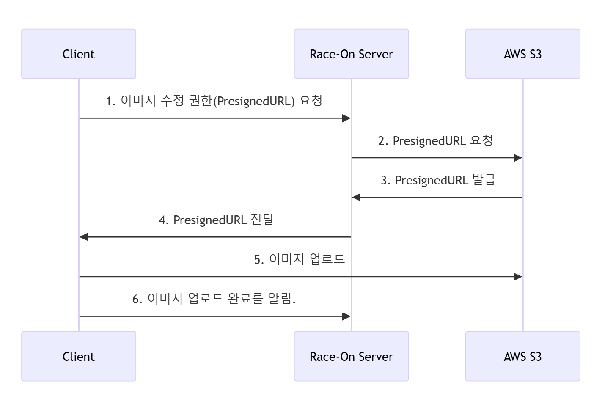

=== 이미지 업로드 방식 설명

이미지 업로드는 PresignedURL 의 형식으로 진행된다.

PresignedURL 의 핵심 아이디어는 아래와 같다.

1. 서버에 직접적으로 이미지를 업로드하는 것은 서버에 부하가 심하다.

2. 서버 부하를 피하기 위해 클라이언트는 서버가 아니라 AWS S3로 직접 이미지를 업로드한다.

3. 단, 아무나 S3에 이미지를 업로드할 수 있게 하는 것은 보안적인 문제가 된다.

4. 서버는 S3로부터 일정 시간동안 이미지 업로드가 가능한 URL(PresignedURL)을 발급받아 클라이언트에게 전달하고 클라이언트는 이를 이용해 이미지를 업로드한다.

* 1~4 : PresignedURL(이미지 업로드 권한) 발급 과정
* 5   : S3에 이미지 업로드 과정
* 6   : 이미지 업로드 성공을 서버에 알리는 과정으로 이 시점에 실제 유저의 프로필 이미지가 변경된다.

